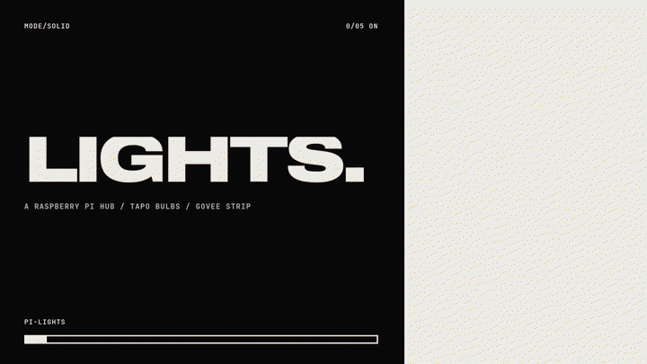

# pi-lights

Smart lights from different manufacturers are normally controlled through separate vendor applications. TP-Link Tapo bulbs require the Tapo app and Govee strips require the Govee Home app. Neither app controls the devices of the other vendor, so lights from the two vendors cannot be switched, dimmed or animated together from either app. pi-lights addresses this problem with an application of its own. A Raspberry Pi acts as a local hub that connects to the devices of each vendor through their native local protocols and presents all lights in one web application, in which they are controlled together and run synchronised lighting effects.

The current implementation runs on a Raspberry Pi 3. It controls four TP-Link Tapo bulbs over Wi-Fi and a Govee H6125 LED strip over Bluetooth Low Energy. Lighting effects are Python scripts that the Pi renders on every light from a shared clock so that the bulbs and the strip change in step. The hub communicates with the lights only on the local network and makes no cloud requests.



## Architecture

The server in `app.py` is built with FastAPI. It discovers the Tapo bulbs through python-kasa and maintains a persistent Bluetooth connection to the strip through `govee.py`, which is based on bleak. The web application in `static/` uses a JSON API and receives the state of every light as a stream of server-sent events.

The effect engine in `engine.py` loads every script in `effects/` and assigns one worker to each light. Each worker reads the shared clock, requests the hue, saturation and level for its light from the active script and sends the result as soon as the previous command has been acknowledged. A Tapo bulb requires approximately 120 ms per command when it is addressed alone and does not interpolate between colours. With all four bulbs animating, a round of commands took approximately 180 ms in measurements on the tested setup, which limits each bulb to five to six updates per second.

The strip applies a gamma curve and per-channel gains to its output so that its colours match those of the bulbs. The correction can be adjusted through `/api/strip/calibration`.

## Hardware

The software was developed and tested with the devices listed below. Other Tapo bulbs supported by python-kasa are expected to work. Other Govee strips may require different Bluetooth commands.

| Device | Connection | Tested version |
|---|---|---|
| Raspberry Pi 3 Model B | Wi-Fi to the bulbs, onboard Bluetooth to the strip | DietPi (Debian 13), Python 3.13 |
| 2 × Tapo L430P (E14) | Wi-Fi, KLAP | firmware 1.0.9 |
| 2 × Tapo L535E (E27) | Wi-Fi, KLAP | firmware 1.4.3 |
| Govee H6125 RGBIC strip | Bluetooth LE | hardware 3.01.10, firmware 3.04.37 |

## Setup

The following steps assume a Raspberry Pi with a 64-bit operating system on the same 2.4 GHz Wi-Fi network as the bulbs. All commands are run as root on the Pi.

### 1. Prepare the Raspberry Pi

Install DietPi or Raspberry Pi OS (64-bit) and connect the Pi to the Wi-Fi network that the bulbs use. Bluetooth must be enabled; on DietPi this setting is located in `dietpi-config` under Advanced Options. Then install the required system packages and uv:

```sh
apt update
apt install -y git curl bluez
systemctl enable --now bluetooth
curl -LsSf https://astral.sh/uv/install.sh | env UV_INSTALL_DIR=/usr/local/bin sh
```

The application is opened through the address of the Pi. It is therefore advisable to reserve a fixed address for the Pi in the DHCP settings of the router.

### 2. Prepare the Tapo bulbs

1. Add every bulb to the Tapo app and connect it to the same 2.4 GHz network as the Pi.
2. In the Tapo app, open Me, then Tapo Lab, then Third-Party Compatibility and enable the option. On the tested L535E bulbs with firmware 1.4.3, local control used the TPAP protocol until this option was enabled. Release 0.10.2 of python-kasa does not support TPAP ([issue 1590](https://github.com/python-kasa/python-kasa/issues/1590)). After the option was enabled, the bulbs used the supported KLAP protocol. The option may have to be enabled again after a firmware update.
3. Note the email address and password of the Tapo account. The hub requires these credentials to authenticate with the bulbs on the local network. They are stored only on the Pi.

### 3. Prepare the Govee strip

The strip requires no configuration in the Govee Home app and no Govee account. It must be powered on and within Bluetooth range of the Pi. The strip accepts only one Bluetooth connection at a time, as the maintainer of homebridge-govee also notes for this model ([issue 1316](https://github.com/homebridge-plugins/homebridge-govee/issues/1316)). The Govee Home app must therefore be closed on every phone before the hub starts. The Bluetooth address of the strip is shown by a scan on the Pi. The tested strip appeared as `Govee_H6125_` followed by four hexadecimal characters. Other units of this model have been reported with names that begin with `ihoment_` or `GBK_` ([govee_ble_lights issue 8](https://github.com/Beshelmek/govee_ble_lights/issues/8)):

```sh
bluetoothctl --timeout 15 scan on
```

### 4. Install the hub

```sh
git clone https://github.com/prakash-aryan/pi-lights.git /opt/lights
cd /opt/lights
uv sync
```

### 5. Configure the hub

Create the configuration file and the credentials file from the examples:

```sh
cp config.example.json config.json
cp lights.env.example /etc/lights.env
chmod 600 /etc/lights.env
```

Enter the email address and password of the Tapo account in `/etc/lights.env`. In `config.json`, set `broadcast` to the broadcast address of the local network (for example `192.168.1.255`) and set `govee.address` to the Bluetooth address of the strip.

The entries `names` and `rooms` are optional. Without them, the application shows the names that were assigned in the Tapo app. A bulb is renamed by adding its MAC address in upper case with colons as separators. The discovery command of python-kasa lists the MAC address of every bulb:

```sh
set -a; . /etc/lights.env; set +a
uv run kasa --username "$TAPO_USERNAME" --password "$TAPO_PASSWORD" --target 192.168.1.255 discover
```

### 6. Start the service

```sh
cp lights.service /etc/systemd/system/
systemctl daemon-reload
systemctl enable --now lights
```

The service listens on port 80 and starts automatically at boot. Its log is available through `journalctl -u lights`.

### 7. Open the application

The application is served at `http://<pi-address>/` and can be opened in any browser on the local network. Chrome on Android installs a web application as a standalone app only from a secure origin. Because the hub is served over plain HTTP, the address of the Pi must first be entered in Chrome under `chrome://flags` in the setting "Insecure origins treated as secure". After Chrome has restarted, its menu can offer Install app, provided that the other installability criteria of Chrome are also met.

## Writing an effect

An effect is a Python file in `effects/` that defines `NAME`, `HINT`, `ORDER` and a function `frame`. The engine calls `frame(t, i, n, state)` with the effect time in seconds, the index of the light, the number of lights and a dictionary that persists for the duration of the effect. The function returns the hue (0 to 360), the saturation (0 to 100) and a level between 0 and 1 that scales the brightness of the light. New scripts are loaded when the service restarts.

```python
import math

NAME = "Sunset"
HINT = "Slow orange to purple"
ORDER = 8


def frame(t, i, n, state):
    return 20 + 260 * (0.5 - 0.5 * math.cos(t / 8)), 90, 1.0
```

Effects that use random events should schedule these events by time, as `storm.py` does, because the engine evaluates `frame` more frequently while a light waits for its next update.

## API

| Method | Path | Body |
|---|---|---|
| GET | `/api/lights` | |
| GET | `/api/stream` | server-sent events |
| POST | `/api/lights/{id}` | `on`, `brightness`, `color`, `temp` |
| POST | `/api/all` | as above, with `only_lit` |
| GET | `/api/effects` | |
| POST | `/api/effects/{name}` | `speed`, `color`, `brightness` |
| POST | `/api/effects/settings` | `speed` |
| POST | `/api/effects/stop` | restores the state from before the effect |
| GET, POST | `/api/strip/calibration` | `gamma`, `gain`, `level` |

## Status

The lists below record the work completed so far and the work that remains open.

### Completed

- [x] Local control of the Tapo L430P and L535E bulbs over Wi-Fi through python-kasa.
- [x] Control of the Govee H6125 strip over Bluetooth, including the colour command for hardware version 3.
- [x] One web application for both vendors with master brightness, per-light switching and brightness, preset colours and a detail view for each light.
- [x] A colour field for any hue and saturation, applied to all lights that are on or to a single light from its detail view.
- [x] Seven synchronised effects (Rainbow, Wave, Party, Breathe, Candle, Storm and Aurora) with adjustable speed.
- [x] Effects defined as Python scripts in `effects/`, with each light keeping its own brightness within an effect.
- [x] Lights that are switched on or off during an effect join or leave it without stopping it.
- [x] Live state updates in the application through server-sent events.
- [x] Colour correction of the strip through an adjustable gamma curve and channel gains.
- [x] Automatic rediscovery of bulbs that are missing at startup or change their address.
- [x] Operation as a systemd service that starts at boot.
- [x] A web app manifest and a service worker so that the application can be installed on a phone.

### Open

- [ ] An effect editor in the application. Effects can currently only be created by writing Python code. The editor would compose effects from colours, timing and transitions and store them as data on the Pi so that they load without a restart of the service.
- [ ] Closer colour matching between the vendors. The correction of the strip was adjusted by eye and the brightness scales of the two vendors are not perceptually aligned. A colour profile for each device derived from colorimeter readings would address this. The colour difference (ΔE2000) between a bulb and the strip at identical settings would serve as the measure of improvement.
- [ ] Smoother fast effects. A Tapo bulb accepts approximately one command every 120 ms and does not fade between colours. Two untested options exist. One is the Matter interface of the L535E, whose colour commands carry a transition time. The other is a 5 GHz USB Wi-Fi adapter, which could relieve the shared radio of the Pi while the bulbs remain on 2.4 GHz.
- [ ] Native support for the TPAP protocol. Local control of recent Tapo firmware depends on the Third-Party Compatibility option until python-kasa supports TPAP.
- [ ] Authentication and HTTPS. Any device on the local network can currently control the lights. HTTPS would also allow installation on Android without a change to the Chrome settings.
- [ ] A common device interface. Support for a further vendor currently requires changes to `app.py`. With a common interface, vendors such as Philips Hue or other Govee models could be added as separate modules.
- [ ] Segment control of the strip. The H6125 has 15 individually addressable segments that are currently driven as one colour.
- [ ] Schedules and automations, for example a gradual sunrise in the morning or switching off at a set time.
- [ ] Automated tests of the effect engine and the API against simulated devices.

## Relation to prior work

This project does not implement the Tapo protocol. It uses [python-kasa](https://github.com/python-kasa/python-kasa) without modification for discovery, authentication and control. Bluetooth communication is handled by [bleak](https://github.com/hbldh/bleak). The Govee frame format follows the notes on other Govee models in [Govee-Reverse-Engineering](https://github.com/egold555/Govee-Reverse-Engineering) and the implementation in [homebridge-govee](https://github.com/homebridge-plugins/homebridge-govee). Each frame has 20 bytes: an identifier byte (0x33 for commands and 0xAA for queries), the command, its parameters and an XOR checksum as the last byte. The colour command used for the H6125 (`33 05 15 01`) is documented in these sources for other models. It was the only colour command that the tested strip accepted, since the strip rejected the older command forms. Bringing devices from several vendors into one interface is not new in itself. Home Assistant and Homebridge already do so for a far wider range of devices. The contribution of this project is limited to a small dedicated hub with its own application that runs synchronised effects across both device families.
